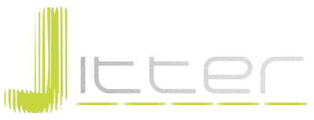

Jitter
======

Jitter is a general purpose Java library for the [Leap Motion Controller](http://leapmotion.com/).

Its primary goal is to provide a user friendly front-end to the technical Leap details.

Its secondary goal is to buffer input from the Leap to throttle FPS down to a suitable level for an application.

Jitter is released under the [LGPL](http://www.gnu.org/copyleft/lesser.html) with the hope that it'll be a useful community resource and project :-)

The [MovingBlocks](https://github.com/movingblocks) team behind [Terasology](http://terasology.org) is hosting a [Jenkins](http://jenkins.movingblocks.net) build for [Jitter](http://jenkins.movingblocks.net/job/Jitter/) with the [latest jar download here](http://jenkins.movingblocks.net/job/Jitter/lastSuccessfulBuild/artifact/build/libs/jitter.jar)

For a sample implementation see the [Terasology prototype thread](http://forum.movingblocks.net/threads/leap-motion-controller.707/) - if you use Jitter in a project please let us know so we can link to you!